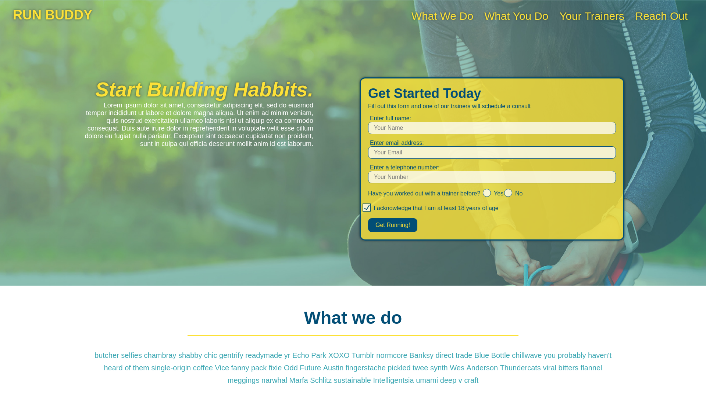

# Run Buddy, Inc

## Purpose

A website that offers fitness training services. A fitness buddy is someone who
will be there for you in the gym and proactively add to your workout.Working out
solo can get lonely. Not to mention, it’s a little too easy to skip the gym when
you’re not feeling motivated! However, having a workout buddy by your side will
help you stick with your fitness goals and make exercise much more enjoyable.

### Benefits of a workout buddy

* More Fun
* Someone to talk to.
* Good ol’ competition.
* You’ll actually show up.
* It’s safer.

### Built With

* HTML
* CSS

## Website

<https://shanebramble.github.io/run-buddy/>

## Contribution

Made with ❤️ by Shane Bramble-Wade

### ©️2021 Run Buddy, Inc
